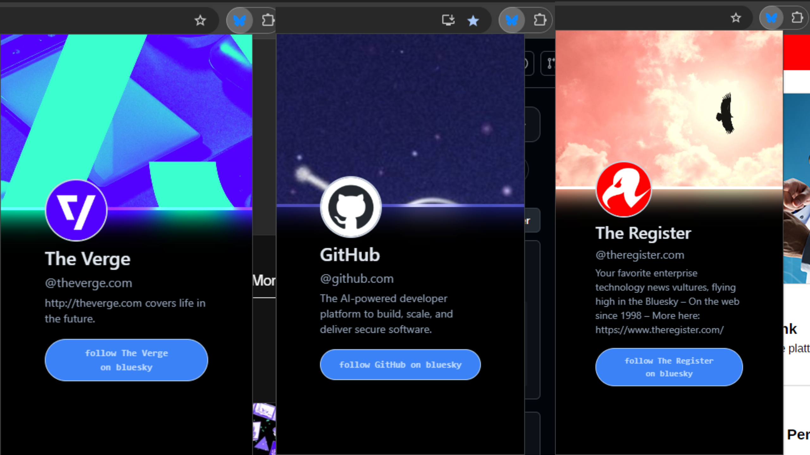
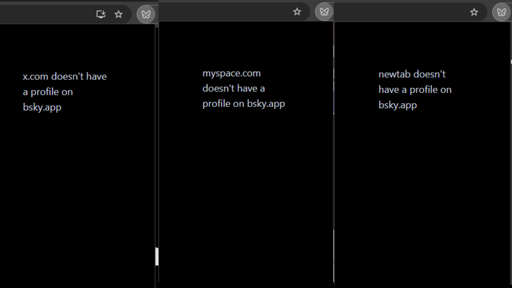
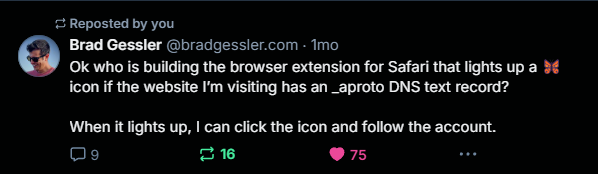

# Butterfly Signal - A Browser Extension To Help You Discover Websites on Bluesky/AtProto [WIP]

<p align="center" style="padding: 5rem 0rem 5rem 0rem">
  
</p>

This is a work in progress (WIP) browser extension that signals a blue butterfly icon, if the domain of the webpage you're actively browsing is on Bluesky. Otherwise, it signals the icon of a gray butterfly outline for the pages that aren't.

Clicking the butterfly will activate the extension's popup page. If the butterfly signal icon is blue/active, the popup will present you with a minified version of that websites Bluesky profile, with links that will take you to their bsky profile page. Otherwise, when the butterfly is dormant/inactive/an outline, the popup will simply inform you that the domain of the page you're currently on, doesn't have a profile on Bluesky.

The popup uses Svelte, while the logic is written with a combo of TypeScript (for data fetching, browser APIs, state management, etc.) and Rust (to handle data transformations/factory tasks). The latter is compiled into Web Assembly prior to building the extension.

## Usage

### IMPORTANT! THIS EXTENSION IS A WIP AS OF 12/20/2024

This project is currently at the *early-experimental prototype* stage. As such, you'll have to compile the extension yourself, and load the unpacked './extension/dist' into a chromium browser with "Developer Mode" enabled. Pre-compiled binaries will be made available for distribution the minute core features are implemented and semi-polished.

To compile the project, see the [contributing](#contributing) prequisites down below for the necessary libraries, then run the following:

```shell
❯ wasm-pack build ./crates/data_factory -t bundler --scope butterfly-signal 
❯ cd ./extension
❯ bun i
❯ bun run build
```

You can also one-line-it for convenience:

```shell
❯ wasm-pack build ./crates/data_factory -t bundler --scope butterfly-signal && cd ./extension && bun i && bun run build
```

The above will generate a unpacked *./dist* you can load into a Chromium based browser.

### Discover the websites that are on Bluesky



### ... and discover the websites that aren't



## Motivation



I liked [@bradgessler's](https://bsky.app/profile/bradgessler.com) idea so much, I wanted to bring it to life.

### Why Web Assembly (Wasm)?

I've been learning Rust recently, and wanted to create something that would bring me full circle to my focus on Web development. Wasm was the perfect bridge for me to do that. So, while the little data_factory crate is arguably a wee bit of an over-optimization step for this project, it's primary goal is educational (for myself), which (so far) it's excelled at.

## Roadmap

### Browser Support

- [ ] Chromium Compatibility (WIP)
- [ ] Firefox Compatibility
- [ ] Safari Compatibility

## Contributing

### Quickstart: Nix/NixOS Users

>#### Prerequisites
>
>0. Install the Nix package manager (if you're not already using NixOS or NixOS-WSL).
>    - [MacOS (Darwin)](https://nixos.org/download/#nix-install-macos)
>    - [Linux](https://nixos.org/download/#nix-install-linux)
>    - [Windows (WSL)](https://nixos.org/download/#nix-install-windows)

1. Fork this repo
2. Run `nix develop` to immediately have access to all the same libraries/versions.
3. After you've made some changes, create a pull request to merge your changes into master. In the description, be sure to detail what you've changed or added, as well as your motivation for doing so.

### The Hardway

>#### Prerequisites
>
>0. Install required libraries into your environment:
>    - **Rust:** rustc, rustup, and cargo
>    - **JS:** nodejs, bun.sh

1. Fork this repo
2. After you've made some changes, create a pull request to merge your changes into master. In the description, be sure to detail what you've changed or added, as well as your motivation for doing so.
